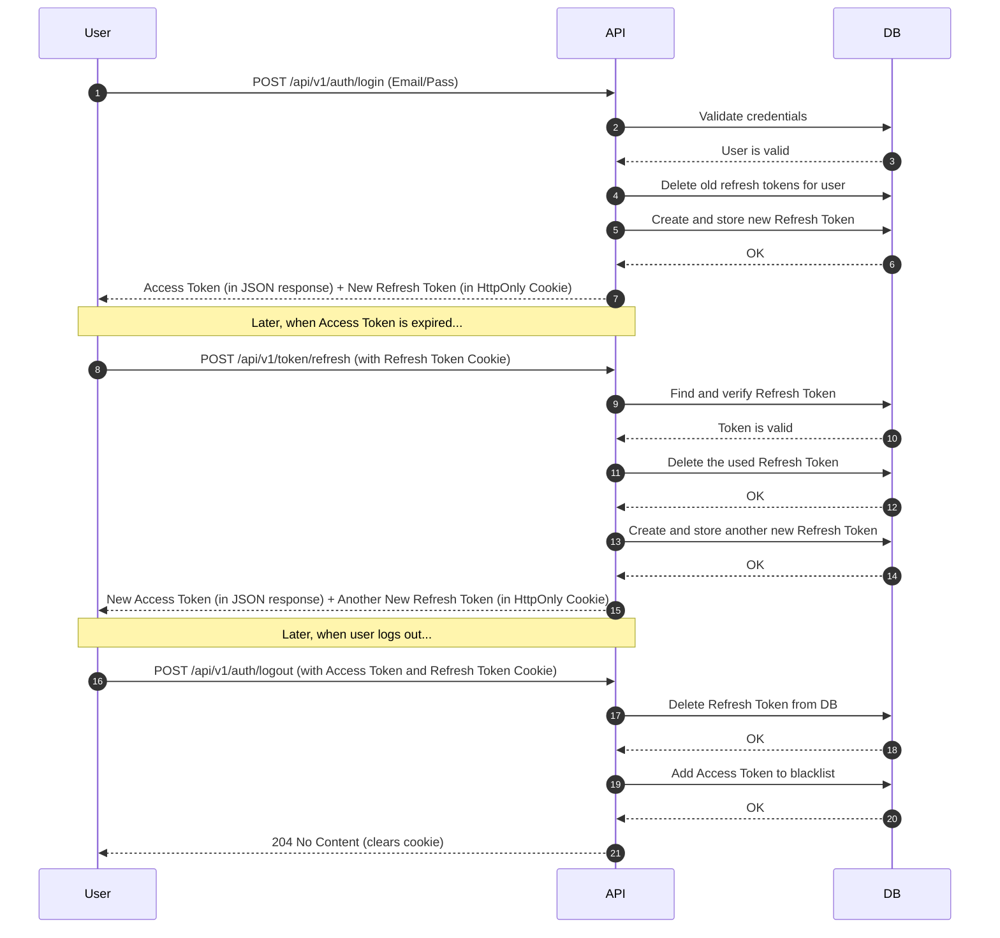
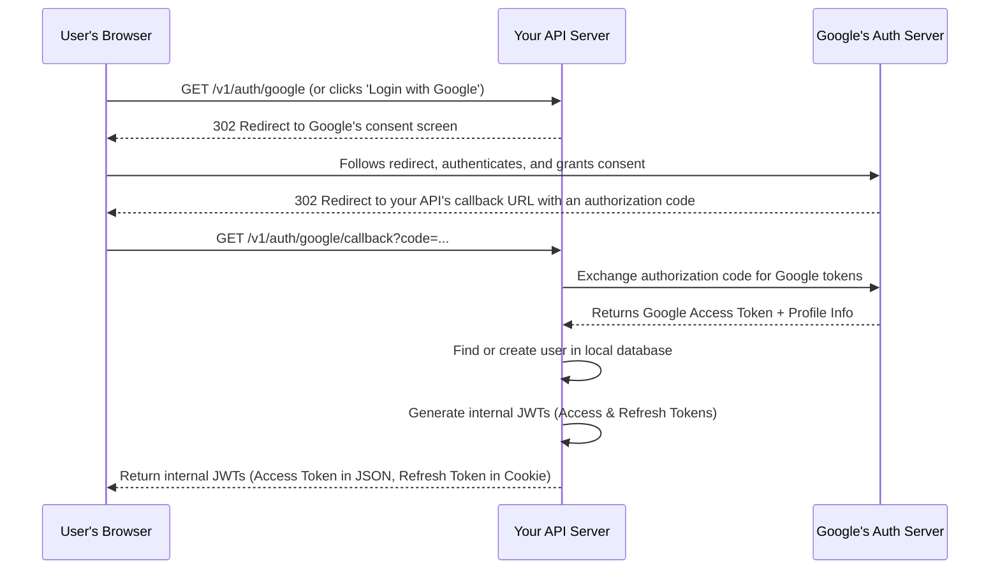
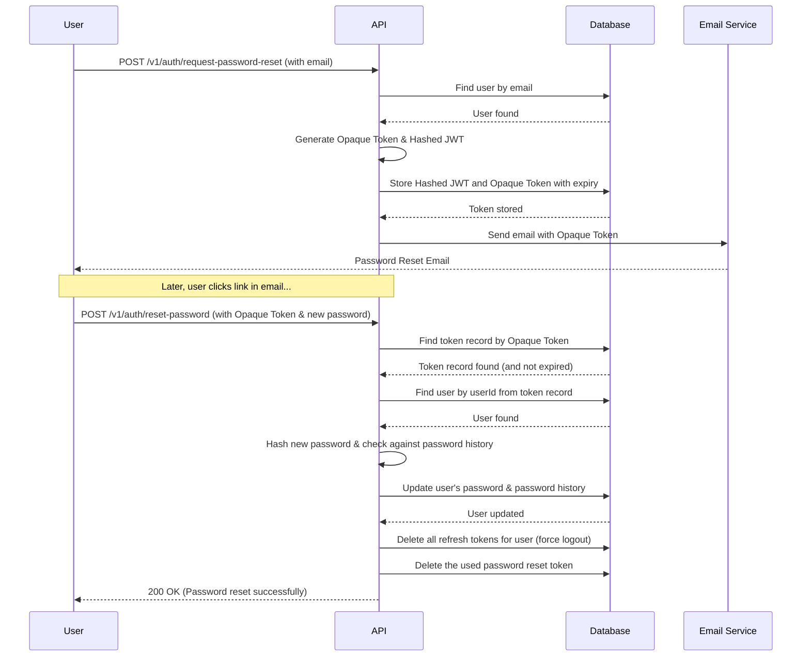

# Authentication

This template provides robust authentication mechanisms using JSON Web Tokens (JWT) for local strategy and integrates with Google OAuth2.0 for third-party authentication. It leverages Passport.js for flexible authentication strategies and includes features like refresh tokens and password reset.

## 1. JWT Authentication

JWT (JSON Web Token) is an open standard (RFC 7519) that defines a compact and self-contained way for securely transmitting information between parties as a JSON object. This template uses JWTs for authenticating users after they log in with their credentials.

### Flow Overview

1.  **User Login:** A user sends their credentials (e.g., email and password) to the API.
2.  **Credential Verification:** The API verifies the credentials against the database.
3.  **Token Generation:** If credentials are valid, the API generates:
*   An **Access Token**: A short-lived token used to access protected resources.
*   A **Refresh Token**: A long-lived token used to obtain new access tokens without re-authenticating.
4.  **Token Storage:** Both tokens are sent to the client. The client typically stores the access token in memory or a secure HTTP-only cookie, and the refresh token in an HTTP-only cookie.
5.  **Resource Access:** For subsequent requests to protected routes, the client sends the access token (usually in the `Authorization` header as a `Bearer` token).
6.  **Token Verification:** The API verifies the access token's signature and expiration. If valid, the request is authorized.
7.  **Token Refresh:** When the access token expires, the client sends the refresh token to a dedicated refresh endpoint. If the refresh token is valid, a new access token (and optionally a new refresh token) is issued.

# Authentication Flow

Here is how the Refresh Token rotation and logout process works:

### Implementation Details

*   **Passport.js Strategy:** The JWT authentication strategy is configured in `src/config/passport.config.ts`. It defines how to extract the JWT from the request and how to verify its payload.
*   **Token Service:** `src/services/token.service.ts` handles the creation, verification, and management of access and refresh tokens. It interacts with the database to store refresh tokens and manage their expiration.
*   **Authentication Middleware:** `src/middleware/auth.middleware.ts` uses Passport.js to authenticate requests. It includes `authenticate` to verify tokens and `authorize` to check user roles against required permissions.
*   **Token Blacklisting:** To enhance security, this template implements a token blacklisting mechanism. When a user logs out, their JWT access token is added to a blacklist. This is managed by the `BlacklistedToken` [model in Prisma](./database-prisma.md#1-prisma-schema-prismaschemaprisma).

### Token Blacklisting and Cleanup

To enhance security, this template implements a token blacklisting mechanism. When a user logs out, their JWT access token is added to a blacklist.

**Flow:**

1.  **Logout:** The user initiates a logout request.
2.  **Blacklist Storage:** The `authService.logout` function adds the user's current access token and its expiration date to the `BlacklistedToken` table in the database.
3.  **Verification:** The `auth` middleware, which protects secure endpoints, checks every incoming access token against this blacklist.
4.  **Rejection:** If a token is found on the blacklist, the request is rejected with a `401 Unauthorized` error, effectively preventing its reuse after logout.

This mechanism ensures that even if an access token is compromised after a user has logged out, it cannot be used to access protected resources.

To prevent the `BlacklistedToken` table from growing indefinitely, a background job runs periodically to remove expired tokens.

*   **Scheduled Job:** A cron job is scheduled to run every hour.
*   **Queueing:** This job adds a `cleanExpiredTokens` task to a BullMQ queue.
*   **Worker Process:** A BullMQ worker processes this task, deleting all tokens from the `BlacklistedToken` table whose expiration date has passed.

This cleanup process is essential for maintaining the performance and efficiency of the authentication system. For more details on how background jobs are implemented, see the [Background Jobs with BullMQ](./background-jobs-bullmq.md) documentation.

### Configuration

Relevant [environment variables](./core-concepts.md#8-configuration-management) in your `.env` file:

*   `JWT_SECRET`: A strong, secret key used to sign JWTs.
*   `JWT_ACCESS_EXPIRATION_MINUTES`: Lifetime of the access token in minutes.
*   `JWT_REFRESH_EXPIRATION_DAYS`: Lifetime of the refresh token in days.

## 2. Google OAuth2.0

The template supports authentication via Google OAuth2.0, allowing users to log in using their Google accounts.

### Flow Overview

1.  **Initiate OAuth:** The client redirects the user to Google's authentication server.
2.  **User Consent:** The user grants permission to your application to access their Google profile.
3.  **Authorization Code:** Google redirects the user back to your application's callback URL with an authorization code.
4.  **Token Exchange:** Your application exchanges the authorization code for access and ID tokens with Google.
5.  **User Profile Retrieval:** Your application uses the access token to fetch the user's profile information from Google.
6.  **Local Account Management:**
*   If a user with the Google ID already exists in your database, they are logged in.
*   If not, a new user account is created in your database using the information from Google.
7.  **JWT Issuance:** Your application then issues its own JWT (access and refresh tokens) to the client, similar to the local login strategy.

### Implementation Details

*   **Passport-Google-OAuth20 Strategy:** Configured in `src/config/passport.config.ts`, this strategy handles the communication with Google's OAuth servers.
*   **Auth Controller:** `src/controllers/auth.controller.ts` contains the endpoints to initiate the Google OAuth flow and handle the callback from Google.
*   **Auth Service:** `src/services/auth.service.ts` manages the creation or retrieval of user accounts based on Google profile information and the issuance of JWTs.

### Configuration

Relevant [environment variables](./core-concepts.md#8-configuration-management) in your `.env` file:

*   `GOOGLE_CLIENT_ID`: Your Google OAuth client ID.
*   `GOOGLE_CLIENT_SECRET`: Your Google OAuth client secret.
*   `GOOGLE_CALLBACK_URL`: The redirect URI registered with Google, pointing to your application's callback endpoint (e.g., `http://localhost:5001/v1/auth/google/callback`).

## 3. Password Reset

The template includes a secure mechanism for users to reset their forgotten passwords.

### Flow Overview

1.  **Request Reset:** A user requests a password reset by providing their email address.
2.  **Token Generation:** The API generates a unique, time-limited password reset token and stores it in the database, associated with the user.
3.  **Email Delivery:** An email containing a link with the password reset token is sent to the user's registered email address.
4.  **Reset Password:** The user clicks the link, which directs them to a page where they can enter a new password. The client sends the new password along with the reset token to the API.
5.  **Token Verification & Password Update:** The API verifies the reset token's validity and expiration. If valid, the user's password is updated, and the reset token is invalidated.

### Implementation Details

*   **Password Reset Token Model:** A dedicated [Prisma model (`PasswordResetToken`)](./database-prisma.md#1-prisma-schema-prismaschemaprisma) stores the reset tokens, their expiration, and links them to users.
*   **Auth Service:** `src/services/auth.service.ts` contains the logic for generating, sending, and verifying password reset tokens, and updating user passwords.
*   **Email Service:** `src/services/email.service.ts` is used to send the password reset email to the user.

## Security Considerations

*   **HTTPS:** Always use HTTPS in production to protect sensitive data during transit.
*   **HTTP-only Cookies:** Store refresh tokens in HTTP-only cookies to mitigate XSS attacks.
*   **Token Expiration:** Configure appropriate expiration times for access and refresh tokens.
*   **Secret Management:** Keep `JWT_SECRET` and OAuth client secrets secure and never expose them publicly.
*   **Rate Limiting:** Implement rate limiting on authentication endpoints to prevent brute-force attacks.

By providing these comprehensive authentication features, the template ensures that your API can securely manage user access and identity.