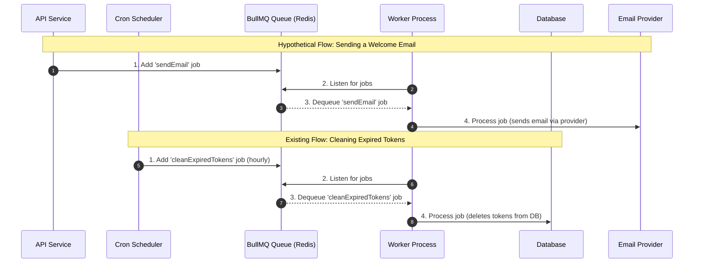

# Background Jobs with BullMQ

This template integrates [BullMQ](https://docs.bullmq.io/) for handling background jobs and asynchronous tasks. BullMQ is a fast, robust, and Redis-backed queueing system that allows you to offload time-consuming operations from your main application thread, improving responsiveness and scalability.

The template comes pre-configured with one background job: a recurring task to clean up expired blacklisted JWTs from the database.

## Why Use Background Jobs?

*   **Improving User Experience:** Offload long-running tasks (e.g., sending emails, processing images) so API requests can return quickly.
*   **Reliability & Scheduling:** Run tasks on a schedule or ensure they are processed even if the main application crashes, with features like retries and persistent queues.
*   **Scalability:** Distribute workloads across multiple worker processes or servers.

## 1. The Existing Job: Token Cleanup

The template includes a cron job that runs every hour to clean out the `BlacklistedToken` table. This prevents the table from growing indefinitely.

### How It Works

1.  **Scheduler (`src/utils/tokenCleanup.ts`):** A `node-cron` scheduler is configured to run every 60 minutes.
2.  **Add Job to Queue:** On schedule, the cron job calls `addTokenCleanupJob` from `src/jobs/queue.ts`, which adds a `cleanExpiredTokens` job to the `tokenCleanup` queue.
3.  **Worker Processes Job (`src/jobs/worker.ts`):** The BullMQ worker, which is listening to the `tokenCleanup` queue, picks up the job.
4.  **Execute Logic:** The worker executes `processTokenCleanupJob`, which runs a Prisma query to `deleteMany` tokens where the `expires` date is in the past.

This entire flow is already set up and requires no additional configuration.

## Visual Flow of Background Jobs

The following diagram illustrates how both scheduled and event-driven jobs are handled by the BullMQ system.



## 2. File Cleanup Worker

The file cleanup worker maintains database hygiene by removing old, abandoned, or temporary files. It runs multiple cleanup jobs based on file status and demo mode configuration.

### Jobs Included

1. **Abandoned Files Cleanup** (Every 24 hours at midnight)
2. **Public Files Cleanup** (Every 10 minutes in demo mode)
3. **Private Files Cleanup** (Every 30 minutes in demo mode)

### How It Works

**Abandoned Files** (`cleanAbandonedFiles`):
- **Schedule**: Daily at midnight UTC (`0 0 * * *`)
- **Target**: Files with status `PENDING` or `FAILED` older than 24 hours
- **Purpose**: Removes incomplete uploads and failed processing attempts
- **Implementation** (`fileCleanup.worker.ts`):
  ```typescript
  const abandonedFiles = await prisma.file.findMany({
    where: {
      status: { in: ['PENDING', 'FAILED'] },
      createdAt: { lt: new Date(Date.now() - 24 * 60 * 60 * 1000) }
    }
  });

  // Delete from S3/R2
  for (const file of abandonedFiles) {
    await s3Client.send(new DeleteObjectCommand({
      Bucket: config.aws.s3.bucket,
      Key: file.fileKey
    }));
    await prisma.file.delete({ where: { id: file.id } });
  }
  ```

**Demo Mode Cleanup** (Public/Private):
- **Schedule**: 
  - Public files: Every 10 minutes (`*/10 * * * *`)
  - Private files: Every 30 minutes (`*/30 * * * *`)
- **Condition**: Only runs if `DEMO_MODE=true`
- **Target**: All `COMPLETED` files (except those owned by demo admin)
- **Purpose**: Keep demo environment clean and prevent storage bloat

> **Important**: Demo mode cleanup is protected by the `DEMO_MODE` environment variable. If `DEMO_MODE=false`, these jobs will skip execution to prevent accidental deletions in production.

### Configuration

Set in your `.env` file:
```bash
DEMO_MODE=true  # Enable demo cleanup jobs
```

## 3. Ingestion Worker

The ingestion worker processes uploaded files for the RAG (Retrieval-Augmented Generation) intelligence pipeline. It extracts content, generates embeddings, and stores them in the vector database.

### How It Works

**Trigger**: Event-driven (triggered when a user confirms file upload)

**Processing Steps**:

1. **Download from R2/S3**: Fetches the file using AWS SDK
2. **Hash Calculation**: Generates SHA-256 hash for deduplication
3. **Duplicate Check**: Compares hash against existing files
4. **Content Extraction**:
   - **PDFs**: Uses `unpdf` library to extract text
   - **Images**: Sends to Gemini Vision model for description
   - **Text files**: Direct UTF-8 decode
5. **Text Chunking**: Splits content into ~1000 character chunks with 200 char overlap
6. **Embedding Generation**: Converts each chunk to 768-D vector using Gemini `text-embedding-004`
7. **Storage**: Saves to PostgreSQL with pgvector extension
8. **Status Update**: Marks file as `COMPLETED`

**Implementation** (`ingestion.worker.ts`):

```typescript
export const processJob = async (job: Job<IngestionJobData>) => {
  const { fileId } = job.data;
  
  // Fetch and process file
  const fileRecord = await prisma.file.findUnique({ where: { id: fileId } });
  
  // Download from S3/R2
  const s3Response = await s3Client.send(new GetObjectCommand({
    Bucket: config.aws.s3.bucket,
    Key: fileRecord.fileKey
  }));

  // Extract text (PDF/Image/Text)
  let text = '';
  if (mimeType === 'application/pdf') {
    const pdf = await getDocumentProxy(buffer);
    text = await extractText(pdf);
  } else if (mimeType.startsWith('image/')) {
    const { text: imageDesc } = await generateText({
      model: google('gemini-2.5-flash-lite'),
      messages: [/* vision prompt */]
    });
    text = imageDesc;
  }

  // Chunk and embed
  const chunks = await splitter.createDocuments([text]);
  for (const chunk of chunks) {
    const { embedding } = await embed({
      model: google.textEmbeddingModel('text-embedding-004'),
      value: chunk.pageContent
    });

    await prisma.$executeRaw`
      INSERT INTO "Document" (id, content, embedding, userId, fileId)
      VALUES (gen_random_uuid(), ${chunk.pageContent}, 
              ${embedding}::vector, ${userId}, ${fileId})
    `;
  }

  await prisma.file.update({
    where: { id: fileId },
    data: { status: 'COMPLETED' }
  });
};
```

### Error Handling

- **File Not Found in S3**: Deletes DB reservation and exits gracefully
- **Duplicate File**: Deletes from S3, marks as `DUPLICATE`
- **Processing Failure**: Marks file as `FAILED`, retries according to BullMQ settings

For more details on the RAG pipeline, see [RAG Intelligence Pipeline](./rag-intelligence-pipeline.md).

---

## 4. Extending with a New Job (Example)

While the template includes token cleanup, file cleanup, and ingestion workers, it is structured to be easily extensible. Let's walk through an example of how to add a new job for sending a welcome email after a user registers.

### Step 1: Define a New Queue

In `src/jobs/queue.ts`, define and export a new queue for emails.

```typescript
// src/jobs/queue.ts

// ... existing redisConnection and defaultQueueOptions

export const tokenCleanupQueueName = 'tokenCleanup';
export const emailQueueName = 'emailQueue'; // 1. Add new queue name

// ... existing addTokenCleanupJob function

// 2. Create a function to add jobs to the new email queue
export const addSendEmailJob = async (queue: Queue, data: { to: string; subject: string; text: string }) => {
  await queue.add('sendEmail', data, defaultQueueOptions.defaultJobOptions);
};
```

### Step 2: Add Logic to the Worker

In `src/jobs/worker.ts`, update the worker process to handle jobs from the new `emailQueue`. Since the worker logic can get complex, it's best to handle different job names.

```typescript
// src/jobs/worker.ts
import { Job } from 'bullmq';
import { prisma } from '../config/db';
import logger from '../utils/logger';
import dotenv from 'dotenv';
// Hypothetical email service
import { emailService } from '../services'; 

dotenv.config();

// Main processing function
export const processJob = async (job: Job) => {
  logger.info(`Processing job ${job.id} of type ${job.name} from queue ${job.queueName}`);

  switch (job.queueName) {
    case 'tokenCleanup':
      if (job.name === 'cleanExpiredTokens') {
        return processTokenCleanupJob(job);
      }
      break;
    
    case 'emailQueue': // 1. Handle the new queue
      if (job.name === 'sendEmail') {
        return processSendEmailJob(job);
      }
      break;

    default:
      throw new Error(`No processor for queue ${job.queueName}`);
  }
};

// Existing token cleanup logic
async function processTokenCleanupJob(job: Job) {
  try {
    const { count } = await prisma.blacklistedToken.deleteMany({
      where: { expires: { lt: new Date() } },
    });
    logger.info(`Cleaned up ${count} expired blacklisted tokens.`);
    return { cleanedCount: count };
  } catch (error) {
    logger.error(error, 'Error cleaning up expired tokens in worker:');
    throw error;
  }
}

// 2. Create a new function for the email job
async function processSendEmailJob(job: Job) {
  try {
    const { to, subject, text } = job.data;
    // Assuming you have an emailService that can send emails
    await emailService.sendEmail(to, subject, text);
    logger.info(`Sent email to ${to}`);
    return { status: 'ok' };
  } catch (error) {
    logger.error(error, `Error sending email to ${job.data.to}:`);
    throw error;
  }
}
```

### Step 3: Instantiate the New Queue and Worker

In `src/server.ts`, where the application is initialized, you need to create the new queue and worker instances.

```typescript
// src/server.ts
// ... other imports
import { Queue, Worker } from 'bullmq';
import { tokenCleanupQueueName, emailQueueName } from './jobs/queue'; // Import new queue name
import { processJob } from './jobs/worker'; // Import the main processor

// ... inside startServer function

// Initialize BullMQ Queues
const tokenCleanupQueue = new Queue(tokenCleanupQueueName, { connection: redisConnection });
const emailQueue = new Queue(emailQueueName, { connection: redisConnection }); // 1. Instantiate new queue

// Initialize BullMQ Workers
const worker = new Worker(
  [tokenCleanupQueueName, emailQueueName], // 2. Listen to both queues
  processJob, 
  { connection: redisConnection }
);

// ... worker event listeners

// Start the cron job for token cleanup
startTokenCleanupJob(tokenCleanupQueue);
```

### Step 4: Add the Job from Your Service

Finally, trigger the job from your business logic. For example, after a user is created in `src/services/auth.service.ts`.

```typescript
// src/services/auth.service.ts
// ... other imports
import { addSendEmailJob } from '../jobs/queue';
import { Queue } from 'bullmq';

// This is a simplified example. In a real app, you would inject the queue
// or use a singleton pattern to access it.
const emailQueue = new Queue('emailQueue', { connection: { host: '...', port: ... } });

// ... inside registerUser function, after user is created
const registerUser = async (userData: RegisterUserBody): Promise<User> => {
  // ... existing logic to create user
  const user = await userService.createUser(userData);

  // Add a job to the email queue
  await addSendEmailJob(emailQueue, {
    to: user.email,
    subject: 'Welcome!',
    text: `Hi ${user.username}, welcome to our platform!`,
  });

  return user;
};
```

This example demonstrates how the existing BullMQ setup can be extended to accommodate new background tasks in a structured and scalable way.
