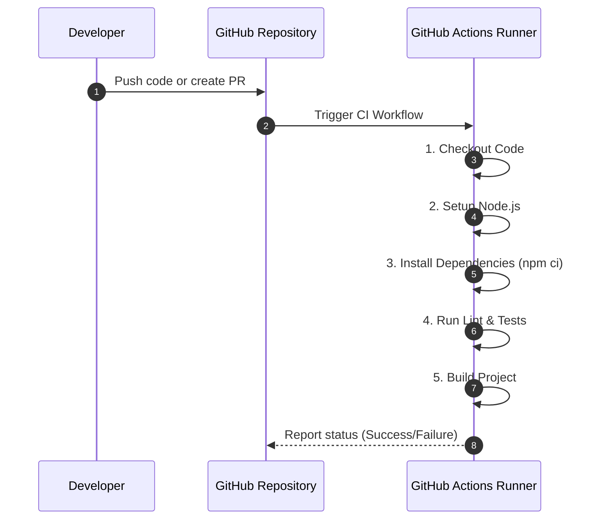
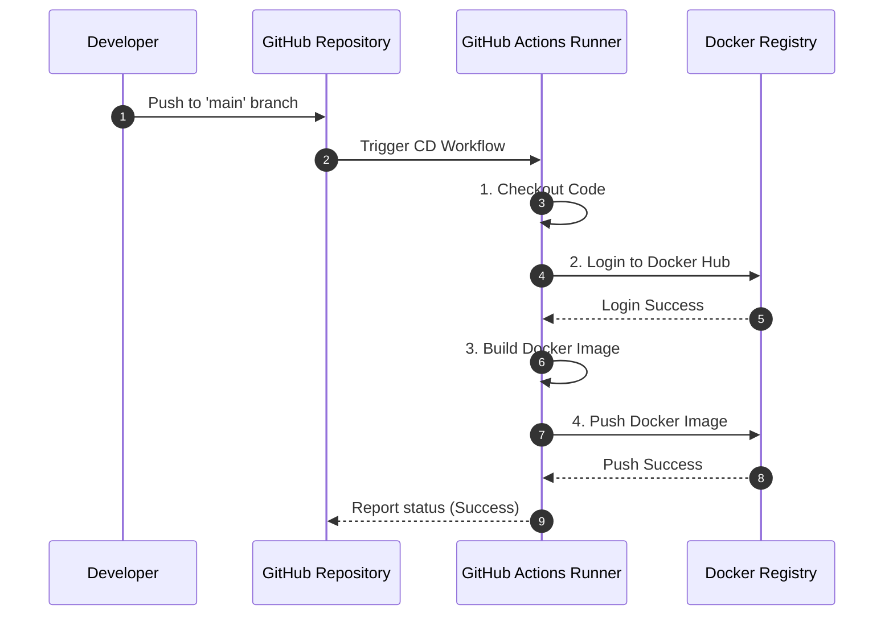

# CI/CD with GitHub Actions

This template includes pre-configured [GitHub Actions](https://docs.github.com/en/actions) workflows to automate your Continuous Integration (CI) and Continuous Deployment (CD) processes. These workflows help ensure code quality, consistency, and efficient delivery of your application.

## Why Automate with GitHub Actions?

*   **Automated Testing:** Automatically run tests on every push to catch bugs early.
*   **Code Quality Checks:** Enforce coding standards (linting, formatting) automatically.
*   **Faster Feedback:** Get immediate feedback on code changes.
*   **Consistent Builds:** Ensure your application builds successfully in a clean environment.
*   **Streamlined Deployment:** Automate the process of deploying your application to various environments.
*   **Version Control Integration:** Tightly integrated with your GitHub repository.

## 1. Continuous Integration (CI) Workflow (`.github/workflows/ci.yml`)

The CI workflow is triggered on every push to the repository and on pull requests. Its primary goal is to validate code changes, run tests, and ensure the application can be built successfully.

**Location:** `.github/workflows/ci.yml`

**Key Steps:**

1.  **Checkout Code:** Fetches the latest code from the repository.
2.  **Setup Node.js:** Configures the Node.js environment.
3.  **Install Dependencies:** Installs project dependencies using `npm install`.
4.  **Run Linting:** Executes ESLint to check for code style and potential errors. 
5.  **Run Tests:** Executes Jest tests (unit and integration tests). Refer to [Testing](./testing.md).
6.  **Build Application:** Compiles the TypeScript source code into JavaScript, preparing it for production.



**Example (`.github/workflows/ci.yml` - simplified):**

```yaml
name: CI

on:
  push:
    branches: [ main, develop ]
  pull_request:
    branches: [ main, develop ]

jobs:
  build:
    runs-on: ubuntu-latest

    steps:
    - uses: actions/checkout@v3
    - name: Use Node.js
      uses: actions/setup-node@v3
      with:
        node-version: '18.x'
        cache: 'npm'
    - name: Install dependencies
      run: npm ci
    - name: Run lint
      run: npm run lint
    - name: Run tests
      run: npm run test
    - name: Build project
      run: npm run build
```

### Customizing the CI Workflow

*   **Node.js Version:** Adjust `node-version` in `actions/setup-node@v3` to your preferred Node.js version.
*   **Test Commands:** Modify `npm run test` to include specific test commands or flags if needed.
*   **Linting/Building:** Update `npm run lint` or `npm run build` if your project uses different scripts.
*   **Environment Variables:** If your CI tests require specific environment variables, you can add them to the `env` section of your job or use GitHub Secrets.

## 2. Continuous Deployment (CD) Workflow (`.github/workflows/publish.yml`)

The CD workflow is typically triggered on pushes to specific branches (e.g., `main` for production, `develop` for staging) or manually. Its purpose is to build and deploy the application, often by creating and pushing Docker images to a container registry. Refer to [Docker Deployment](./deployment.md#1-docker-deployment) for more details.

**Location:** `.github/workflows/publish.yml`

**Key Steps (Example for Docker Image Publishing):**

1.  **Checkout Code:** Fetches the repository code.
2.  **Login to Docker Hub (or other registry):** Authenticates with your container registry.
3.  **Build Docker Image:** Builds the Docker image using your `Dockerfile`.
4.  **Tag and Push Image:** Tags the image with appropriate versioning (e.g., `latest`, commit SHA) and pushes it to the registry.



**Example (`.github/workflows/publish.yml` - simplified for Docker Hub):**

```yaml
name: Publish Docker Image

on:
  push:
    branches: [ main ] # Trigger on push to main branch
  workflow_dispatch: # Allows manual triggering

jobs:
  build-and-push:
    runs-on: ubuntu-latest
    steps:
    - name: Checkout code
      uses: actions/checkout@v3

    - name: Log in to Docker Hub
      uses: docker/login-action@v2
      with:
        username: ${{ secrets.DOCKER_USERNAME }}
        password: ${{ secrets.DOCKER_PASSWORD }}

    - name: Build and push Docker image
      uses: docker/build-push-action@v4
      with:
        context: .
        push: true
        tags: your-dockerhub-username/my-node-app:latest
```

### Customizing the CD Workflow

*   **Trigger:** Adjust the `on` section to define when the workflow should run (e.g., different branches, tags, or manual triggers).
*   **Registry:** Modify the Docker login and build/push actions for your specific container registry (e.g., AWS ECR, Google Container Registry).
*   **Image Naming/Tagging:** Customize the image name and tags to follow your versioning strategy.
*   **Deployment Steps:** For actual deployment to a cloud provider (e.g., Render, AWS ECS, Kubernetes), you would add additional steps here using provider-specific GitHub Actions or CLI commands. Refer to [Cloud Deployment](./deployment.md#3-cloud-deployment-render) for more details.

## 3. GitHub Secrets

Sensitive information required by your workflows (e.g., Docker Hub credentials, cloud provider API keys) should be stored as [GitHub Secrets](https://docs.github.com/en/actions/security-guides/encrypted-secrets). This ensures that your credentials are encrypted and not exposed in your workflow files or logs.

*   Go to your repository settings -> `Secrets and variables` -> `Actions`.
*   Add new repository secrets (e.g., `DOCKER_USERNAME`, `DOCKER_PASSWORD`).

By leveraging these GitHub Actions workflows, you can establish a robust and automated CI/CD pipeline, significantly enhancing your development efficiency and product delivery.