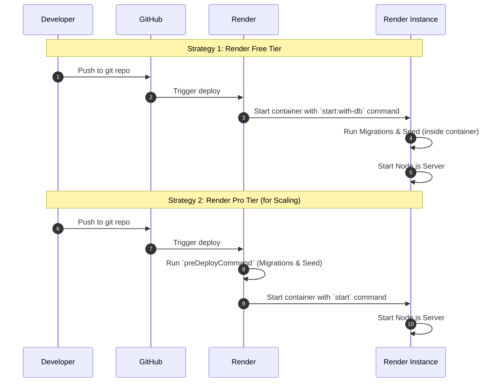

This template is designed for flexible deployment, supporting containerization with Docker and providing guidance for cloud platforms. This section will cover how to prepare and deploy your application.

## 1. Docker Deployment
Docker provides a consistent environment for your application across development, testing, and production. This template includes `Dockerfile`, `Dockerfile.dev`, and `docker-compose.yml` files to facilitate containerization.

### Dockerfile (Production)
The `Dockerfile` defines the steps to build a Docker image of your application, primarily for production deployments.

**Location:** `Dockerfile` (at the project root)

**Key Optimizations:**

*   **Multi-Stage Build:** Uses a builder stage to compile TypeScript and a runner stage for the final image.
*   **Security:** Runs as a non-root user (`appuser`) for security best practices.
*   **Prisma Optimization:** Efficiently handles the Prisma Client generation and copies it to the final image.
*   **Static Assets:** Automatically copies the `public/` folder so your static client files work in production.

**Building the Docker Image:**

```bash
docker build -t my-node-app .
```

**Running the Docker Container:**

```bash
docker run -p 5001:5001 --env-file ./.env my-node-app
```

### Dockerfile.dev (Local Development)
The `Dockerfile.dev` is specifically designed for local development.

**Location:** `Dockerfile.dev` (at the project root)

**Key Features:**

*   **Smart Entrypoint:** Uses `docker-entrypoint.dev.sh` to automatically wait for the database to be ready, run migrations, and seed the database on startup.
*   **Hot-Reloading:** Includes `nodemon` to restart the server on file changes.
*   **Cached Layers:** Optimizes build speed by caching dependencies.

### docker-compose.yml
This template uses a modular Docker Compose setup to keep configurations clean.

**Key Services:**

*   `app`: Your Node.js application (built using `Dockerfile.dev`).
*   `db`: PostgreSQL database.
*   `redis`: Redis server for caching and queues.

**Starting Services (Recommended):**

We provide helper scripts to manage the modular compose files automatically:

```bash
# Start all services (App + DB + Redis)
npm run docker:up

# Start in detached mode (background)
npm run docker:up:detached

# Stop and remove all containers
npm run docker:down
```

## 2. Cloud Deployment (Railway) (Recommended)

This template is fully optimized for **[Railway](https://railway.app/)**, providing a seamless experience for developers who prefer a modern, high-performance PAAS.

### The Railway Advantage
Railway offers a unique "Infrastructure-as-Code" experience through its modular architecture. To support this, we've included several dedicated configuration artifacts:

*   **`railway.toml`**: Optimized build and run instructions specifically for the Railway engine.
*   **`.env.railway`**: A template for environment variables pre-configured for Railway's networking.
*   **`Dockerfile.railway`**: A specialized production image that ensures smooth Prisma Client generation within the Railway environment.

### Instant Infrastructure (Drag & Drop)
One of Railway's most powerful features is the ability to provision infrastructure using Docker Compose files. 

We provide two pre-configured templates for this purpose:
*   `docker-compose.postgres.railway.yml`
*   `docker-compose.redis.railway.yml`

> [!TIP]
> **Pro Tip:** You can simply drag and drop these `.railway.yml` files into the Railway dashboard playground to instantly deploy managed PostgreSQL and Redis instances.

### Guided Deployment
For a deep dive into the "easy" process of deploying this entire template on Railway, including environment setup and service linking, follow our dedicated guide.

[👉 **Railway Deployment Tutorial**](https://nodejs-starter-template-lv1-production-db8d.up.railway.app/client/railway.html)

## 3. Cloud Deployment (Render)
The template includes a `render.yaml` file, which is a blueprint for deploying your application to Render.

### 🚨 danger "Important: Environment Variables" 

**Critical Setup Step:** Render Blueprints cannot automatically import secrets from your local `.env` file for security reasons.

- **Do NOT** upload your `.env` file to the "Secret Files" tab in Render (this will not work with the app structure).
- **DO** copy the content of your local `.env` and paste it into the "Environment Variables" section of your Render Service Dashboard.

###
When you copy your .env content to paste into Render, exclude these lines:

❌ NODE_ENV=... (Handled by Docker)

❌ JWT_SECRET=... (Handled by Render Blueprint)

❌ PORT=... (Render sets this automatically to match your EXPOSE instruction)

Keep everything else (AWS keys, Google keys, ADMIN_EMAIL, JWT_RESET_PASSWORD_SECRET, CLIENT_URL, etc.).


###

### Default Deployment (Free Tier)
By default, the `Dockerfile` and `render.yaml` are configured for the Render Free Tier.

**Strategy:** Migrations and Seeding run automatically inside the Docker Startup Command.

**Why:** The Free Tier allows only 1 instance. Running migrations on startup is safe because there are no race conditions with a single instance.

**How to Deploy:**

1.  Connect your GitHub repository to Render.
2.  Create a **New Blueprint Instance**.
3.  Render will detect `render.yaml` and provision the Database, Redis, and Web Service automatically.

#### Free Tier Limitations

!!! warning "Important Considerations for Render's Free Tier"
    When using Render's free tier, please be aware of the following limitations:

*   **Redis Data Loss:** The `redis` service on the free plan is ephemeral. If your instance restarts for any reason, all data stored in Redis (such as session information and cached data) will be permanently lost. This is acceptable for testing and development, but it is **highly recommended** to upgrade to a paid plan for production environments to ensure data persistence.

*   **PostgreSQL Database:** The free PostgreSQL database is subject to limitations, including expiration after 90 days of inactivity or limited usage quotas. For production applications requiring long-term data storage, consider upgrading to a paid database plan.

*   **`repo` Field in `render.yaml`:** The `repo` field in the `render.yaml` file is typically not required if you create the Blueprint directly from the Render dashboard while connected to your GitHub account. Render automatically associates the repository. Removing this line can make the configuration more generic and portable.

## 4. Scaling & Production (Render Pro)
### How to Upgrade to Render Pro
By default, this template uses the `start:with-db` logic inside the Docker image. If you upgrade to a Paid Plan (Starter/Standard) and want to scale to multiple instances (replicas), you must change this behavior to prevent **Database Locking** (multiple instances trying to migrate simultaneously).

The diagram below illustrates the key difference between the two strategies:



**Steps to configure for Scaling:**

1.  Open `render.yaml`.
2.  Change `plan` from `free` to `starter` (or your desired paid plan).
3.  **Add a Pre-Deploy Command:** This ensures migrations run only once, on a temporary instance, before the new version goes live.

```yaml
# render.yaml
services:
    - type: web
    name: my-app
    plan: starter # or standard
    # ...
    preDeployCommand: "sh -c 'npx prisma migrate deploy && npm run seed:prod'"
```

4.  **Override the Docker Command:** Tell Render to ignore the default `Dockerfile` command (which includes migrations) and just start the server.

```yaml
# render.yaml
services:
    - type: web
    name: my-app
    # ...
    dockerCommand: "node dist/server.js"
```

This configuration ensures zero-downtime deployments and allows you to scale to 10+ instances safely.

## 5. Production Scripts
These `package.json` scripts are used internally by the `Dockerfile` and Render configuration.

- **`build`**: The heavy lifter.
    - Generates the Prisma Client to `node_modules`.
    - Compiles the main app to `dist`.
    - Compiles Seeds: Compiles `prisma/seed.ts` into a standalone JS file (`dist/prisma/seed.js`) so it can run in production without `ts-node`.
- **`start`**: The standard production command (`node dist/server.js`). Use this when handling migrations via a separate Pre-Deploy command.
- **`start:with-db`**: The "Lazy" production command. It runs `migrate deploy -> seed:prod -> node dist/server.js`. This is the default command used by the `Dockerfile` for the Free Tier.
