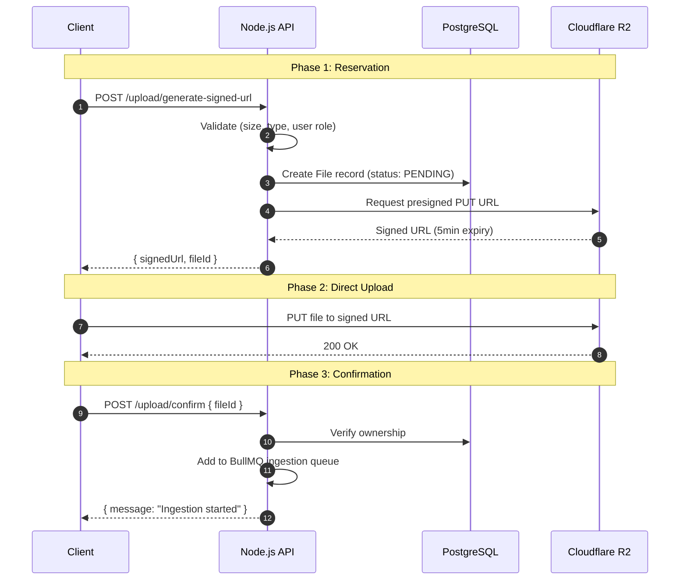
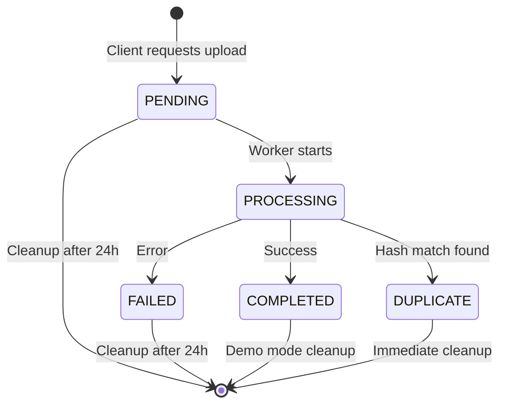

# File Upload Architecture

## Overview

This template implements a **secure, scalable file upload system** that never streams files through your Node.js server. Instead, it uses **presigned URLs** to enable direct client-to-cloud uploads to **Cloudflare R2** (S3-compatible storage).

### Why This Pattern?

Traditional file uploads stream data through your backend:

```
Client → Node.js Server → Cloud Storage
```

**Problems**:
- Server becomes a bottleneck
- Consumes server bandwidth and memory
- Vulnerable to DoS attacks (large file uploads)
- Difficult to scale

**Our Solution** (Direct Upload):

```
Client → Cloudflare R2 (direct)
       ↓
    Backend (confirm)
```

## The Reservation Pattern

The upload flow uses what we call the **"Reservation Pattern"** - a three-phase process that ensures data integrity and security.



## Detailed Flow

### Phase 1: Generate Signed URL

**Client Request**:

```typescript
POST /api/v1/upload/generate-signed-url
Authorization: Bearer <jwt_token>

{
  "fileName": "company-handbook.pdf",
  "fileType": "application/pdf",
  "fileSize": 2097152, // 2 MB in bytes
  "isPublic": false
}
```

**Backend Logic** (`upload.service.ts`):

1. **Validate File Type**:
   ```typescript
   const allowedTypes = [
     'image/jpeg', 'image/png', 'image/gif', 'image/webp',
     'application/pdf', 'text/plain', 'text/markdown', 'text/csv'
   ];
   
   if (!allowedTypes.includes(fileType)) {
     throw new ApiError(400, 'Invalid file type');
   }
   ```

2. **Validate File Size**:
   ```typescript
   const maxSize = 5 * 1024 * 1024; // 5 MB
   if (fileSize > maxSize) {
     throw new ApiError(400, 'File too large');
   }
   ```

3. **Access Control** (Public Files):
   ```typescript
   let finalIsPublic = false;
   if (isPublic && (user.role === 'ADMIN' || user.role === 'CONTRIBUTOR')) {
     finalIsPublic = true;
   }
   ```

4. **Create DB Reservation**:
   ```typescript
   const fileKey = `users/${user.id}/${uuidv4()}-${sanitizedFileName}`;
   
   const file = await prisma.file.create({
     data: {
       fileKey,
       mimeType: fileType,
       originalName: fileName,
       userId: user.id,
       status: 'PENDING', // ← Reservation
       isPublic: finalIsPublic
     }
   });
   ```

5. **Generate Presigned URL**:
   ```typescript
   const command = new PutObjectCommand({
     Bucket: config.aws.s3.bucket,
     Key: fileKey,
     ContentType: fileType
   });
   
   const signedUrl = await getSignedUrl(s3Client, command, { 
     expiresIn: 60 * 5 // 5 minutes
   });
   ```

**Response**:

```json
{
  "signedUrl": "https://[account].r2.cloudflarestorage.com/...",
  "fileKey": "users/uuid/uuid-company-handbook.pdf",
  "fileId": "file-uuid"
}
```

### Phase 2: Client Upload

The client uploads **directly** to R2 using the signed URL:

```javascript
// Frontend Example
const response = await fetch(signedUrl, {
  method: 'PUT',
  headers: { 'Content-Type': fileType },
  body: file
});

if (!response.ok) {
  throw new Error('Upload failed');
}
```

**No backend involvement!** The file streams from browser directly to R2.

### Phase 3: Confirm Upload

Once the upload succeeds, the client confirms:

```typescript
POST /api/v1/upload/confirm
Authorization: Bearer <jwt_token>

{
  "fileId": "file-uuid"
}
```

**Backend Logic**:

1. **Verify Ownership**:
   ```typescript
   const file = await prisma.file.findUnique({ where: { id: fileId } });
   
   if (!file) throw new ApiError(404, 'File not found');
   if (file.userId !== user.id) throw new ApiError(403, 'Unauthorized');
   ```

2. **Trigger Background Ingestion**:
   ```typescript
   await ingestionService.addIngestionJob({ fileId });
   ```

The file remains `PENDING` until the background worker processes it. See [RAG Intelligence Pipeline](rag-intelligence-pipeline.md) for ingestion details.

## Security Features

### 1. No Server Streaming

Files **never** touch your Node.js server. This prevents:
- Memory exhaustion attacks
- Server bandwidth saturation
- Complexity of handling multipart uploads

### 2. Time-Limited URLs

Presigned URLs expire after **5 minutes**. Even if leaked, they become useless quickly.

### 3. File Type Whitelist

Only specific MIME types are allowed. Prevents executable uploads (`.exe`, `.sh`, etc.).

### 4. Size Limits

Hard limit of **5 MB** per file. Configurable in `upload.service.ts`.

### 5. Ownership Verification

The `/confirm` endpoint verifies the file belongs to the requesting user before processing.

### 6. Rate Limiting (Demo Mode)

In demo environments, uploads are rate-limited:

```typescript
// src/middleware/rateLimiter.ts
export const uploadRateLimiter = rateLimit({
  windowMs: 24 * 60 * 60 * 1000, // 24 hours
  max: (req) => (req.user?.role === 'ADMIN' ? 100 : 2),
  message: 'Upload limit reached. Try again in 24 hours.',
  skip: (req) => !config.demoMode
});
```

**Limits**:
- Regular users: **2 uploads / 24 hours**
- Admins: **100 uploads / 24 hours**
- Production: **No limit** (rate limiter disabled when `DEMO_MODE=false`)

## Cloudflare R2 vs AWS S3

This template uses **Cloudflare R2** but is **100% S3-compatible**. You can switch to AWS S3 by changing the endpoint.

### Why Cloudflare R2?

| Feature | Cloudflare R2 | AWS S3 |
|---------|---------------|--------|
| **Egress Fees** | $0 (Free) | $0.09/GB |
| **Storage** | $0.015/GB/month | $0.023/GB/month |
| **Free Tier** | 10 GB storage | 5 GB (12 months only) |
| **API** | S3-compatible | Native |

**For most apps**, R2's free egress makes it cheaper, especially for file downloads.

### Switching to AWS S3

Remove or comment out the `endpoint` configuration:

```typescript
// src/services/upload.service.ts
const s3Client = new S3Client({
  region: config.aws.region,
  // endpoint: process.env.AWS_ENDPOINT, // ← Remove this line
  credentials: {
    accessKeyId: config.aws.accessKeyId,
    secretAccessKey: config.aws.secretAccessKey,
  },
});
```

Update `.env`:

```bash
AWS_REGION=us-east-1
AWS_S3_BUCKET=your-s3-bucket
# Remove AWS_ENDPOINT
```

## File Status Lifecycle



**States**:
- `PENDING`: Reservation created, awaiting upload confirmation
- `PROCESSING`: Background worker is ingesting
- `COMPLETED`: Successfully processed and indexed
- `FAILED`: Processing error (e.g., corrupt file)
- `DUPLICATE`: SHA-256 hash matched existing file

## Cleanup Workers

See [Background Jobs (BullMQ)](background-jobs-bullmq.md#2-file-cleanup-worker) for automatic cleanup:

- **Abandoned files**: PENDING/FAILED files older than 24 hours
- **Demo mode**: Auto-delete completed files (respects `DEMO_MODE` env var)

## Configuration

### Environment Variables

```bash
# Cloudflare R2
AWS_REGION=auto
AWS_ENDPOINT=https://<account-id>.r2.cloudflarestorage.com
AWS_ACCESS_KEY_ID=<r2-access-key>
AWS_SECRET_ACCESS_KEY=<r2-secret-key>
AWS_S3_BUCKET=your-bucket-name

# Demo Mode (optional)
DEMO_MODE=true  # Enables rate limiting and periodic cleanup
```

### Get Cloudflare R2 Credentials

1. Go to [Cloudflare Dashboard](https://dash.cloudflare.com/) → R2
2. Create a bucket
3. Generate API tokens (R2 → Manage R2 API Tokens)
4. Copy credentials to `.env`

## Troubleshooting

### "Upload failed" (403 Forbidden)

**Cause**: Presigned URL expired (>5 min)  
**Solution**: Request a new signed URL

### "File not found" during confirmation

**Cause**: Upload to R2 failed, but client thinks it succeeded  
**Solution**: Check R2 dashboard, verify CORS settings

### "Unauthorized access to file"

**Cause**: User trying to confirm someone else's upload  
**Solution**: This is working as intended (security feature)

### File stuck in PENDING

**Cause**: Client never called `/confirm`  
**Solution**: Automatic cleanup after 24 hours

## Next Steps

- Learn about [RAG Intelligence Pipeline](rag-intelligence-pipeline.md)
- Explore [Upload API Routes](routes-documentations/upload-routes.md)
- Review [Background Jobs](background-jobs-bullmq.md)
