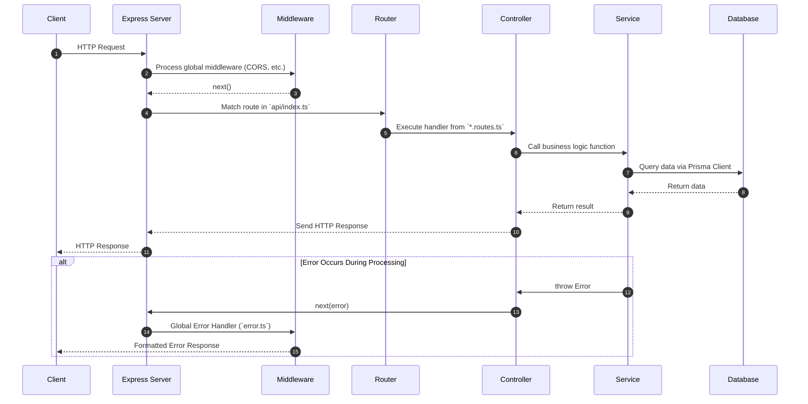

# Project Structure

Understanding the project's directory structure is crucial for navigating the codebase, locating specific functionalities, and contributing effectively. This template follows a clear and modular organization to promote maintainability and scalability.

## Request Lifecycle Flow

The following diagram illustrates how a typical HTTP request flows through the different layers of the application architecture.



Here's an overview of the main directories and files:

```
.
├───.github/                      # GitHub Actions workflows for CI/CD
├───.husky/                       # Git hooks for pre-commit checks
├───dist/                         # Compiled JavaScript output (generated from src/)
├───documentation/              # The Nodejs Advanced Starter Template documentation powered by MkDocs
├───node_modules/                 # Installed Node.js dependencies
├───prisma/                       # Prisma schema, migrations, and seed script
├───public/                       # Static files served by the application (e.g., client-side HTML, JS)
├───src/                          # Main application source code (TypeScript)
│   ├───api/                      # API route definitions
│   ├───config/                   # Application configuration settings
│   ├───controllers/              # Request handling logic
│   ├───docs/                     # OpenAPI documentation generation
│   ├───jobs/                     # Background job definitions and workers (BullMQ)
│   ├───middleware/               # Express middleware functions
│   ├───services/                 # Business logic and data manipulation
│   ├───types/                    # Custom TypeScript type definitions
│   ├───utils/                    # Utility functions and helpers
│   ├───validations/              # Request data validation schemas (Zod)
│   └───server.ts                 # Main application entry point
├───tests/                        # Unit and integration tests
├───.env.example                  # Example environment variables file
├───.gitignore                    # Specifies intentionally untracked files to ignore
├───.prettierrc.js                # Prettier configuration for code formatting
├───docker-compose.mysql.yml      # Docker Compose configuration for MySQL
├───docker-compose.postgres.yml   # Docker Compose configuration for PostgreSQL
├───docker-compose.override.yml   # Docker Compose override configuration for development
├───docker-compose.yml            # Docker Compose configuration for local services
├───docker-entrypoint.dev.sh      # Smart entrypoint for development Docker containers
├───Dockerfile                    # Dockerfile for production builds
├───Dockerfile.dev                # Dockerfile for development builds
├───eslint.config.mjs             # ESLint configuration file
├───package.json                  # Project metadata and dependencies
├───prisma.config.ts              # Prisma configuration
├───railway.toml                  # Railway deployment configuration
├───README.md                     # Project README file
├───render.yaml                   # Render deployment configuration
└───tsconfig.json                 # TypeScript compiler configuration
```

## Directory Breakdown

### `.github/`
Contains [GitHub Actions workflows for CI/CD](./ci-cd-github-actions.md).
*   `workflows/ci.yml`: Defines the Continuous Integration pipeline (linting, testing, building).
*   `workflows/publish.yml`: Defines the Continuous Deployment pipeline (e.g., publishing Docker images).

### `.husky/`
Configures [Git hooks]. Currently used for `pre-commit` hooks to run linters and formatters before committing code, ensuring code quality.

### `dist/`
This directory is automatically generated when you compile the TypeScript source code. It contains the transpiled JavaScript files that Node.js executes. You should not manually edit files in this directory.

### `md-documentation/`
This directory contains the comprehensive documentation for the project, including guides, explanations of core concepts, and setup instructions.

### `node_modules/`
Managed by npm or Yarn, this directory stores all the project's third-party dependencies. It should not be committed to version control.

### `prisma/`
Houses all files related to [Prisma ORM](./database-prisma.md).

*   `schema.prisma`: Defines your database schema, including models, relations, and enums.
*   `migrations/`: Stores database migration files generated by Prisma Migrate.
*   `seed.ts`: Contains scripts to populate your database with initial data.

### `public/`
Contains static assets that are served directly by the web server. This might include client-side JavaScript, HTML files, images, or other static resources.

### `src/`
This is the heart of the application, containing all the TypeScript source code.

*   #### `src/api/`
    Defines the [API routes](./core-concepts.md#1-api-routing). Each file typically corresponds to a major resource or domain:
    *   `admin.routes.ts`: Admin-specific endpoints (e.g., creating notifications)
    *   `agent.routes.ts`: AI agent chat endpoint for RAG-powered Q&A
    *   `auth.routes.ts`: Authentication endpoints (login, register, OAuth)
    *   `file.routes.ts`: File listing and management
    *   `notification.routes.ts`: Notification management (mark as read, delete)
    *   `token.routes.ts`: Token refresh and management
    *   `upload.routes.ts`: File upload (presigned URLs, confirmation)
    *   `user.routes.ts`: User management and profile endpoints
    *   `index.ts`: Aggregates all routes and exports the main router

*   #### `src/config/`
    Manages [application-wide configuration settings](./core-concepts.md#8-configuration-management).
*   `config.ts`: Loads and validates environment variables, providing a centralized configuration object.
*   `db.ts`: Handles database connection setup (e.g., Prisma Client initialization).
*   `passport.config.ts`: Configures [Passport.js strategies for authentication](./authentication.md) (JWT, Google OAuth).

*   #### `src/controllers/`
    Contains the [logic for handling incoming HTTP requests](./core-concepts.md#2-controllers) and preparing responses. Controllers interact with services to perform business operations and then send back appropriate HTTP responses.

*   #### `src/docs/`
    Dedicated to [generating the OpenAPI specification and serving the Swagger UI](./api-documentation-openapi.md).
*   `openapi.ts`: Main file for defining the OpenAPI document structure.
*   `openAPIRegistry.ts`: Registers API paths and schemas for OpenAPI generation.
*   `paths/`: Contains individual OpenAPI path definitions, often linked to specific routes.

*   #### `src/jobs/`
    Manages [background tasks using BullMQ](./background-jobs-bullmq.md).
*   `queue.ts`: Defines and initializes job queues (token cleanup, file cleanup, ingestion).
*   `scheduler.ts`: Configures cron schedules for recurring jobs.
*   `tokenCleanup.worker.ts`: Processes expired token cleanup jobs.
*   `fileCleanup.worker.ts`: Handles abandoned file cleanup and demo mode file deletion.
*   `ingestion.worker.ts`: Processes uploaded files for the RAG pipeline (text extraction, embedding generation).

*   #### `src/middleware/`
    Houses [Express middleware functions](./core-concepts.md#4-middleware) that process requests before they reach the route handlers or after they leave.
*   `auth.middleware.ts`: JWT authentication and role-based authorization.
*   `error.ts`: Global error handling middleware.
*   `rateLimiter.ts`: API rate limiting (with demo mode support).
*   `socket.middleware.ts`: Socket.IO authentication middleware.
*   `validate.ts`: Request data validation using Zod schemas.

*   #### `src/services/`
    Encapsulates the core business logic of the application. Services interact with the database (via Prisma), external APIs (e.g., Cloudflare R2 for file storage, Google Gemini for AI), and other services. Key services include:
    *   `auth.service.ts`: Authentication logic (login, registration, password reset)
    *   `upload.service.ts`: File upload via presigned URLs (Cloudflare R2/AWS S3)
    *   `file.service.ts`: File listing and filtering
    *   `ingestion.service.ts`: Triggers background ingestion jobs for RAG
    *   `notification.service.ts`: Creates and manages notifications with online/offline delivery
    *   `socket.service.ts`: Real-time communication via Socket.IO
    *   `user.service.ts`: User CRUD operations and profile management

*   #### `src/types/`
    Contains custom TypeScript declaration files (`.d.ts`) for extending existing types or defining new global types specific to the application.

*   #### `src/utils/`
    A collection of [general-purpose utility functions and helper classes](./core-concepts.md#6-error-handling) used across the application.
*   `ApiError.ts`: Custom error class for standardized API error responses.
*   `logger.ts`: Configures and exports the Pino logger instance.
*   `tokenCleanup.ts`: Utility for managing token-related tasks.

*   #### `src/validations/`
    Defines [Zod schemas for validating incoming request data](./core-concepts.md#5-validation) (body, query parameters, path parameters). Validation files include:
    *   `admin.validation.ts`: Admin notification creation
    *   `agent.validation.ts`: AI chat message validation
    *   `auth.validation.ts`: Login, register, password reset validation
    *   `file.validation.ts`: File listing filters
    *   `notification.validation.ts`: Notification management
    *   `upload.validation.ts`: File upload (size, type, metadata)
    *   `user.validation.ts`: User profile and update validation

*   #### `src/server.ts`
    The main entry point of the application. It sets up the Express app, connects to the database, registers middleware, defines routes, and starts the server.

### `tests/`
Contains all [test files](./testing.md) for the application. Tests are organized to mirror the `src/` directory structure, making it easy to find tests for specific components.

## Root Level Files

*   `.cursorrules` & `.gemini/GEMINI.md`: These files contain a set of rules and guidelines for AI assistants (like Cursor or Gemini) to follow when working on this project. They define the architectural patterns, coding standards, and critical "must-follow" rules to ensure that AI-generated code is consistent with the project's design. They are not used by the application itself but are crucial for maintaining code quality when using AI-powered development tools.
*   `.env.example`: A template file for environment variables. Copy this to `.env` and fill in your specific configurations.
*   `.gitignore`: Specifies files and directories that Git should ignore.
*   `.prettierrc.js`: Configuration file for Prettier, ensuring consistent code formatting.
*   `docker-compose.mysql.yml`: Defines the Docker Compose setup for using a MySQL database.
*   `docker-compose.postgres.yml`: Defines the Docker Compose setup for using a PostgreSQL database.
*   `docker-compose.redis.yml`: Defines the Docker Compose setup for using a Redis service.
*   `docker-compose.postgres.railway.yml` & `docker-compose.redis.railway.yml`: Specialized Docker Compose templates for Railway's "drag and drop" infrastructure provisioning.
*   `docker-compose.override.yml`: Contains development-specific overrides for `docker-compose.yml`. It enables features like hot-reloading and mounts the local source code into the container. Docker Compose automatically merges this file, so you don't have to reference it manually when using `npm run docker:up`.
*   `docker-compose.yml`: Defines multi-container Docker applications. Used for local development services (e.g., databases), excluding Redis which is now in `docker-compose.redis.yml`.
*   `docker-entrypoint.dev.sh`: A smart entrypoint script for development Docker containers.
*   `Dockerfile`: Instructions for building a Docker image of your application for production deployment.
*   `Dockerfile.dev`: Instructions for building a Docker image of your application for development.
*   `Dockerfile.railway`: Specialized production Dockerfile optimized for the Railway deployment engine.
*   `eslint.config.mjs`: Configuration file for ESLint, a tool for identifying and reporting on patterns found in ECMAScript/JavaScript code.
*   `package.json`: Contains project metadata, dependencies, and a variety of scripts for development, building, testing, and more. For a detailed breakdown of all available scripts, see the [npm scripts section in the Getting Started guide](./getting-started.md#4-available-npm-scripts).
*   `prisma.config.ts`: Configuration for Prisma, often used for custom Prisma Client generation or data proxy settings.
*   `railway.toml`: Configuration file for building and deploying the application on Railway.
*   `README.md`: The main README file for the project, providing a quick overview.
*   `render.yaml`: Configuration file for deploying the application to Render.
*   `tsconfig.json`: TypeScript compiler configuration file.

This structured approach helps in maintaining a clean, understandable, and scalable codebase, making it easier for new developers to onboard and for existing developers to manage features and fixes.