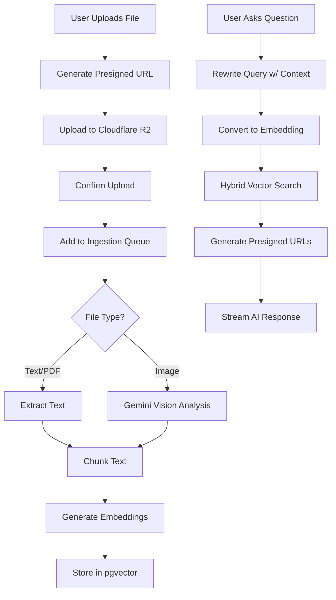

# RAG Intelligence Pipeline

## Overview

The **RAG (Retrieval-Augmented Generation) Intelligence Pipeline** is an advanced AI feature that allows your application to answer questions based on uploaded documents. Unlike traditional AI chatbots that rely solely on pre-trained knowledge, this system dynamically retrieves relevant information from your custom knowledge base and uses it to generate accurate, context-aware responses.

### What is RAG?

RAG combines two powerful AI concepts:

1. **Retrieval**: Finding relevant documents from a knowledge base using semantic search
2. **Generation**: Using an AI model (like Google's Gemini) to generate human-like responses based on retrieved context

This approach ensures your AI assistant provides answers grounded in your specific data, reducing hallucinations and improving accuracy.

## Architecture Overview



## How It Works

### Phase 1: File Ingestion

When a user uploads a file, the system processes it through an asynchronous pipeline:

#### Step 1: File Upload (Reservation Pattern)

The upload follows a secure "reservation" pattern:

```typescript
// 1. Client requests signed URL
POST /api/v1/upload/generate-signed-url
{
  "fileName": "company-docs.pdf",
  "fileType": "application/pdf",
  "fileSize": 524288,
  "isPublic": false
}

// 2. Backend creates PENDING record in DB
const file = await prisma.file.create({
  data: {
    fileKey: `users/${userId}/uuid-company-docs.pdf`,
    status: 'PENDING',
    userId,
    // ...
  }
});

// 3. Client uploads directly to R2 using signed URL
// 4. Client confirms upload
POST /api/v1/upload/confirm
{ "fileId": "uuid" }
```

See [File Upload Architecture](file-upload-architecture.md) for detailed flow.

#### Step 2: Background Processing

Once confirmed, a BullMQ job is triggered (`ingestion.worker.ts`):

**For Text Files (PDF, TXT, Markdown):**

1. **Download from R2**: Fetch the file using AWS SDK
2. **Hash Check**: Calculate SHA-256 to detect duplicates
3. **Text Extraction**: Parse content (PDF uses `unpdf` library)
4. **Chunking**: Split text into ~1000 character chunks with 200 char overlap
5. **Embedding**: Convert each chunk to a 768-dimension vector using Gemini's `text-embedding-004`
6. **Storage**: Save to PostgreSQL with pgvector extension

**For Images (JPEG, PNG, WEBP, GIF):**

1. **Multimodal Analysis**: Send image to Gemini Vision model (`gemini-2.5-flash-lite`)
2. **Description Generation**: AI describes visual content, text, and data tables
3. **Chunking \u0026 Embedding**: Process description text like above

**Example Code from `ingestion.worker.ts`:**

```typescript
// Image processing
if (mimeType.startsWith('image/')) {
  const { text: imageDesc } = await generateText({
    model: google('gemini-2.5-flash-lite'),
    messages: [{
      role: 'user',
      content: [
        {
          type: 'text',
          text: 'Analyze this image in detail. Extract all visible text...'
        },
        { type: 'image', image: buffer }
      ]
    }]
  });
  text = imageDesc;
}

// Generate embeddings
for (const chunk of chunks) {
  const { embedding } = await embed({
    model: google.textEmbeddingModel('text-embedding-004'),
    value: chunk.pageContent,
  });

  // Store in pgvector
  await prisma.$executeRaw`
    INSERT INTO "Document" (id, content, metadata, userId, fileId, embedding, createdAt)
    VALUES (gen_random_uuid(), ${chunk.pageContent}, ${metadata}::jsonb, 
            ${userId}, ${fileId}, ${embedding}::vector, NOW())
  `;
}
```

### Phase 2: Intelligent Retrieval

When a user asks a question, the system performs sophisticated retrieval:

#### Step 1: Contextual Query Rewriting

If the conversation has history, the system uses Gemini to rewrite the query:

```typescript
// User: "Who is Elon Musk?"
// AI: "He is the CEO of Tesla and SpaceX"
// User: "How old is he?"

// System rewrites "How old is he?" → "How old is Elon Musk?"
const { text } = await generateText({
  model: google('gemma-3-12b'),
  messages: conversationHistory,
  system: 'Rewrite the last message into a standalone search query...'
});
```

#### Step 2: Vector Embedding

Convert the refined query to the same 768-D vector space:

```typescript
const { embedding } = await embed({
  model: google.textEmbeddingModel('text-embedding-004'),
  value: refinedQuery
});
```

#### Step 3: Hybrid Search (Vector + Metadata)

The system performs a **hybrid search** combining:

- **Vector Similarity**: pgvector's `<=>` operator (cosine distance)
- **Access Control**: Filters by user ownership OR public visibility

```sql
SELECT d.content, d.metadata, f."originalName", f."fileKey", f."isPublic",
       (d.embedding <=> $vectorQuery::vector) as distance
FROM "Document" d
LEFT JOIN "File" f ON d."fileId" = f.id
WHERE (d."userId" = $currentUserId OR f."isPublic" = true)
ORDER BY distance ASC
LIMIT 5
```

**Security Model**:
- Users can search their **own private documents**
- Users can search **any public document** (uploaded by admins/contributors)
- Users **cannot** see other users' private documents

#### Step 4: Smart Citations

For each retrieved document, the system generates a **temporary presigned URL** (valid 1 hour) so the AI can cite sources:

```typescript
const signedUrl = await getSignedUrl(s3Client, new GetObjectCommand({
  Bucket: config.aws.s3.bucket,
  Key: doc.fileKey
}), { expiresIn: 3600 });

// Package for AI
const context = documents.map(doc => 
  `Source: ${doc.originalName} [${doc.isPublic ? 'Public' : 'Private'}]
   Link: ${signedUrl}
   Content: ${doc.content}`
).join('\n\n');
```

#### Step 5: AI Response Generation

Finally, stream the response using Gemini:

```typescript
const result = streamText({
  model: google('gemini-2.5-flash-lite'),
  messages: userConversation,
  system: `Answer based ONLY on this context. Cite sources using [Source](Link).
  
  Context:
  ${context}`
});

result.pipeTextStreamToResponse(res);
```

## Configuration

### 1. Google AI API Key

You need a Google Generative AI API key:

1. Visit [Google AI Studio](https://aistudio.google.com/app/apikey)
2. Create an API key
3. Add to `.env`:

```bash
GOOGLE_GENERATIVE_AI_API_KEY=your_api_key_here
```

### 2. pgvector Extension

Ensure your PostgreSQL database has the `pgvector` extension:

```sql
CREATE EXTENSION IF NOT EXISTS vector;
```

This is typically configured in your database migrations. See [Database (Prisma)](database-prisma.md#what-is-pgvector) for details.

### 3. Supported Models

The free tier includes:
- `gemini-2.5-flash-lite` (recommended for chat)
- `gemini-2.5-flash` (higher quality)
- `gemma-3-12b` (lightweight)
- `text-embedding-004` (embeddings only)

Check [Google AI pricing](https://ai.google.dev/pricing) for limits.

### 4. AI Model Configuration

The specific AI models used for ingestion, chat, and embeddings are configured in `src/config/ai-models.ts`. You can modify this file to switch between different Gemini models (e.g., upgrading from `gemini-2.5-flash-lite` to `gemini-1.5-pro` for better reasoning).

### 5. Prompt Configuration

You can customize the specific instructions given to the AI in `src/config/prompts.ts`. This allows you to fine-tune the persona, response style, and query refinement logic without changing the core code.

| Prompt Key | Purpose |
|------------|---------|
| `ingestion.imageAnalysis` | Instructions for Gemini Vision to extract information from images during file upload. |
| `agent.queryRewriter` | Instructions for rewriting the user's latest message into a standalone search query based on conversation history. |
| `agent.systemPrompt` | The master instruction for the RAG chatbot. It controls how the AI answers questions and cites sources. |

**Important:** When editing `agent.systemPrompt`, ensure you preserve the `{{context}}` placeholder, as this is where the retrieved documents are injected. Also, strict citation formats (e.g., `[Source Name](Link)`) are critical for the frontend to render clickable source links.

## File Support

| File Type | Processing Method | Max Size |
|-----------|------------------|----------|
| PDF | Text extraction via `unpdf` | 5 MB |
| Text/Markdown | Direct UTF-8 decode | 5 MB |
| JPEG/PNG/GIF/WEBP | Gemini Vision → Text description | 5 MB |

## Performance Considerations

**Chunking Strategy**:
- Chunk size: 1000 characters
- Overlap: 200 characters (preserves context across boundaries)

**Why Overlap?** If a sentence is split across chunks, the overlap ensures at least one chunk contains the full context.

**Embedding Dimensions**: 768 (Gemini text-embedding-004)

**Search Results**: Top 5 most relevant chunks

## Troubleshooting

### "No text extracted from file"

- **Cause**: PDF might be image-based (scanned document)
- **Solution**: Use OCR preprocessing or upload as image

### "Model not available in your region"

- **Cause**: Some Gemini models have geographic restrictions
- **Solution**: Switch to `gemma-3-12b` or any other globally available gemini model (models are always changing and updated so make sure you're using the latest)

### "Vector dimension mismatch"

- **Cause**: Database schema expects different vector size
- **Solution**: Verify `Document.embedding` is `vector(768)`

### "Duplicate file detected"

- **Info**: This is expected! The system deduplicates files by SHA-256 hash
- **Behavior**: New upload is marked `DUPLICATE`, original remains

## Next Steps

- Learn about [File Upload Architecture](file-upload-architecture.md)
- Explore [Agent API Routes](routes-documentations/agent-routes.md)
- Review [Background Jobs](background-jobs-bullmq.md) setup
