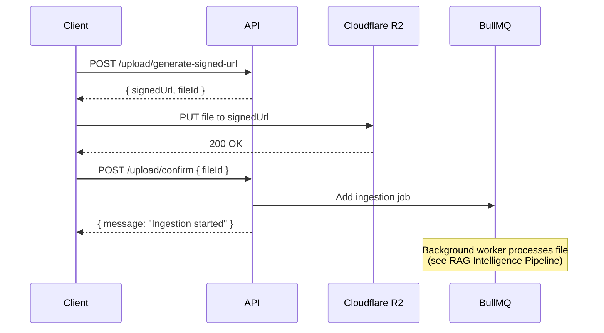

# Upload Routes

This document describes the API routes for secure file uploads using the **Reservation Pattern** with Cloudflare R2 (S3-compatible storage).

## Overview

The upload system uses presigned URLs to enable **direct client-to-cloud uploads**, ensuring files never stream through your Node.js server. This improves performance, security, and scalability.

See [File Upload Architecture](../file-upload-architecture.md) for detailed architecture and flow diagrams.

---

## Generate Signed URL

Generates a presigned URL for direct upload to Cloudflare R2 and creates a reservation in the database.

* **URL**  
    `/v1/upload/generate-signed-url`
* **Method:**  
    `POST`
* **Authentication:**  
    Required (JWT Token in `Authorization` header), User Role: `USER`
* **Rate Limiting:**  
    In demo mode (`DEMO_MODE=true`): 2 uploads per 24 hours for regular users, 100 for admins
* **Request Body:**

```json
{
  "fileName": "company-handbook.pdf",
  "fileType": "application/pdf",
  "fileSize": 2097152,
  "isPublic": false
}
```

**Properties:**
* `fileName` (string, required): Desired filename (will be sanitized)
* `fileType` (string, required): MIME type of the file
  * **Allowed values:** `image/jpeg`, `image/png`, `image/gif`, `image/webp`, `application/pdf`, `text/plain`, `text/markdown`, `text/csv`
* `fileSize` (number, required): File size in bytes
  * **Maximum:** 5 MB (5,242,880 bytes)
* `isPublic` (boolean, optional): Make file accessible to all users (requires `ADMIN` or `CONTRIBUTOR` role)

* **Success Response:**  
  * **Code:** `200 OK`
  * **Content:**

```json
{
  "signedUrl": "https://[account].r2.cloudflarestorage.com/...",
  "fileKey": "users/user-uuid/uuid-company-handbook.pdf",
  "fileId": "file-uuid-123"
}
```

**Properties:**
* `signedUrl` (string): Presigned PUT URL valid for **5 minutes**
* `fileKey` (string): S3/R2 object key
* `fileId` (string): Database file record ID (needed for confirmation)

* **Error Responses:**  
  * **Code:** `400 Bad Request`
    ```json
    {
      "code": 400,
      "message": "Invalid file type. Only JPEG, PNG, GIF, WEBP, PDF, and TEXT files are allowed."
    }
    ```
    Or:
    ```json
    {
      "code": 400,
      "message": "File size must be less than 5MB."
    }
    ```
  * **Code:** `401 Unauthorized`
    ```json
    {
      "code": 401,
      "message": "Please authenticate"
    }
    ```
  * **Code:** `429 Too Many Requests` (Demo mode only)
    ```json
    {
      "code": 429,
      "message": "Upload limit reached. Try again in 24 hours."
    }
    ```

---

## Confirm Upload

Confirms successful upload and triggers background ingestion for RAG indexing.

* **URL**  
    `/v1/upload/confirm`
* **Method:**  
    `POST`
* **Authentication:**  
    Required (JWT Token in `Authorization` header), User Role: `USER`
* **Request Body:**

```json
{
  "fileId": "file-uuid-123"
}
```

**Properties:**
* `fileId` (string, required): File ID returned from `/generate-signed-url`

* **Success Response:**  
  * **Code:** `200 OK`
  * **Content:**

```json
{
  "message": "Ingestion started",
  "fileId": "file-uuid-123"
}
```

* **Error Responses:**  
  * **Code:** `404 Not Found`
    ```json
    {
      "code": 404,
      "message": "File not found"
    }
    ```
  * **Code:** `403 Forbidden`
    ```json
    {
      "code": 403,
      "message": "Unauthorized access to file"
    }
    ```
    This occurs when trying to confirm someone else's upload.

---

## Complete Upload Flow



### Client Example (JavaScript)

```javascript
// Step 1: Get signed URL
const { signedUrl, fileId } = await fetch('/api/v1/upload/generate-signed-url', {
  method: 'POST',
  headers: {
    'Content-Type': 'application/json',
    'Authorization': `Bearer ${token}`
  },
  body: JSON.stringify({
    fileName: file.name,
    fileType: file.type,
    fileSize: file.size,
    isPublic: false
  })
}).then(r => r.json());

// Step 2: Upload directly to R2
await fetch(signedUrl, {
  method: 'PUT',
  headers: { 'Content-Type': file.type },
  body: file
});

// Step 3: Confirm
await fetch('/api/v1/upload/confirm', {
  method: 'POST',
  headers: {
    'Content-Type': 'application/json',
    'Authorization': `Bearer ${token}`
  },
  body: JSON.stringify({ fileId })
});
```

---

## Security Features

1. **No Server Streaming**: Files bypass Node.js entirely, preventing memory/bandwidth attacks
2. **Time-Limited URLs**: Presigned URLs expire after 5 minutes
3. **File Type Whitelist**: Only safe MIME types allowed
4. **Size Limits**: 5 MB maximum per file
5. **Ownership Verification**: `/confirm` validates file belongs to requesting user
6. **Rate Limiting**: Demo mode limits uploads to prevent abuse

---

## File Status Lifecycle

After confirmation, files go through background processing:

| Status | Description |
|--------|-------------|
| `PENDING` | Reservation created, awaiting confirmation |
| `PROCESSING` | Background worker ingesting content |
| `COMPLETED` | Successfully indexed for RAG search |
| `FAILED` | Processing error |
| `DUPLICATE` | SHA-256 hash matched existing file |

Track status via [File Routes](file-routes.md).

---

## Troubleshooting

### "Upload failed" (presigned URL PUT returns 403)

**Cause**: URL expired (>5 minutes since generation)  
**Solution**: Request new signed URL

### "File not found" during `/confirm`

**Cause**: Client never uploaded to R2, or R2 upload failed  
**Solution**: Verify R2 upload succeeded, check network logs

### "Unauthorized access to file"

**Cause**: Trying to confirm file uploaded by another user  
**Solution**: This is expected security behavior

---

## Related Documentation

* [File Upload Architecture](../file-upload-architecture.md) - Detailed reservation pattern explanation
* [RAG Intelligence Pipeline](../rag-intelligence-pipeline.md) - How uploaded files are processed
* [File Routes](file-routes.md) - List and manage uploaded files