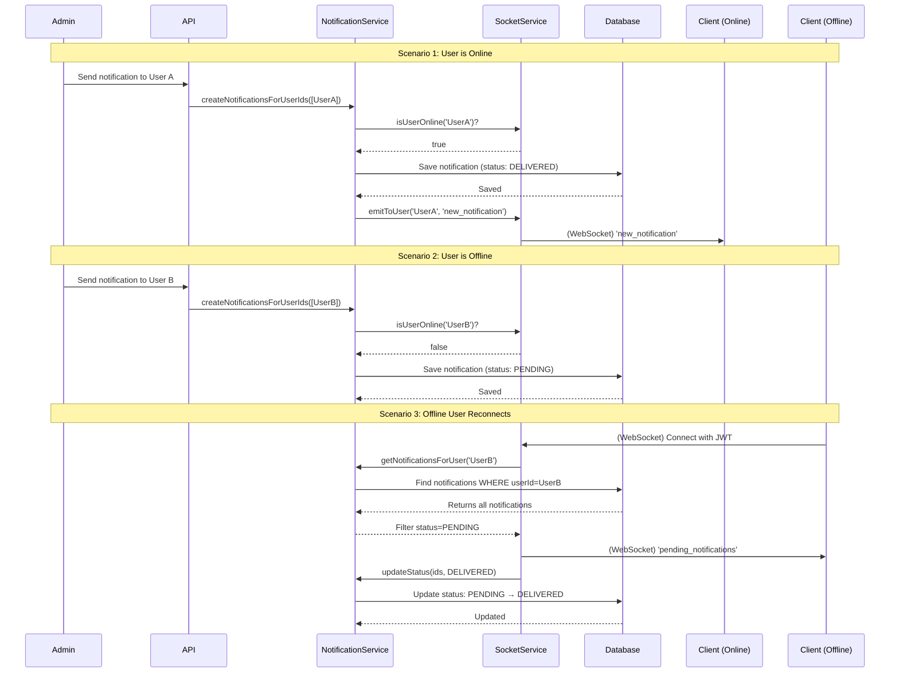

# Socket.IO Service and Real-time Notifications

This section details the implementation of real-time communication using Socket.IO, including how the client connects, how notifications are handled for both online and offline users, and the role of the `public` directory in serving the Socket.IO client.

## Overview

The application leverages Socket.IO to provide real-time notifications to users. This functionality is crucial for features like administrative alerts or instant updates. The system is designed to ensure that users receive notifications even if they are offline at the time the notification is sent.

## Architecture

### Server-side (Node.js with Socket.IO)

The core of the Socket.IO server is managed by the `SocketService` (`src/services/socket.service.ts`) and integrated into the main Express application in `src/server.ts`.

1.  **Initialization**:
    *   In `src/server.ts`, the `SocketService` is initialized by calling `socketService.init(server)`, where `server` is the HTTP server instance.
    *   CORS is configured to allow connections from specified origins.
    *   A custom `socketAuthMiddleware` (`src/middleware/socket.middleware.ts`) is applied to authenticate incoming Socket.IO connections using JWT tokens. This ensures that only authenticated users can establish a real-time connection.

2.  **Connection Handling**:
    *   When a client connects, the `socketService` logs the connection and, if the user is authenticated, joins the socket to a private room named after the `userId`. This allows for targeted communication to individual users.
    *   **Pending Notification Delivery**: Upon a successful connection, the `socketService` queries the database for all notifications belonging to that user via `notificationService.getNotificationsForUser`. It filters for notifications with status `PENDING` and emits them to the client using the `pending_notifications` event. After successful delivery, these notifications are **updated** from `PENDING` to `DELIVERED` status (they remain in the database for history tracking).
    *   Disconnection events are also handled and logged.

3.  **Notification Creation (`notificationService.ts`)**:
    *   The `notificationService.createNotificationsForUserIds` function (`src/services/notification.service.ts`) is responsible for creating and delivering notifications.
    *   **Immediate Database Persistence**: All notifications are immediately saved to the database for ALL target users, regardless of their online status.
    *   For each target user, the system checks if they are currently online using `socketService.isUserOnline(userId)`.
    *   **Status Assignment**:
        *   If the user is **online**: The notification is saved with status `DELIVERED` AND immediately emitted to their socket using `socketService.emitToUser` with the `new_notification` event.
        *   If the user is **offline**: The notification is saved with status `PENDING` to be delivered later when the user reconnects.

### Client-side (`public/client.js` and `public/index.html`)

The `public` directory serves a simple HTML page (`index.html`) and a JavaScript file (`client.js`) that demonstrate how to connect to and interact with the Socket.IO server.

1.  **Serving the Client**:
    *   In `src/server.ts`, the line `app.use('/client', express.static(path.join(__dirname, '../public')));` configures Express to serve static files from the `public` directory under the `/client` URL path. This means `public/index.html` is accessible at `/client/index.html` and `public/client.js` at `/client/client.js`.

2.  **Client Connection**:
    *   `public/index.html` includes the Socket.IO client library from a CDN and then loads `public/client.js`.
    *   `public/client.js` handles the connection logic:
        *   It prompts the user for a JWT access token.
        *   When the "Connect" button is clicked, it initializes a Socket.IO connection, passing the JWT token in the `Authorization` header via the `extraHeaders` option. This token is then used by the server's `socketAuthMiddleware` for authentication.
        *   It listens for various Socket.IO events:
            *   `connect`: Indicates a successful connection.
            *   `disconnect`: Indicates a disconnection.
            *   `connect_error`: Reports any connection errors.
            *   `new_notification`: Receives real-time notifications sent by the admin or other services.
            *   `pending_notifications`: Receives notifications that were stored in the database while the user was offline and are now being delivered upon reconnection.

## How Offline Notifications Work

The system ensures reliable notification delivery through an **immediate persistence strategy** combined with status tracking:

### The Notification Lifecycle

1. **Admin/Service Creates Notification**: An admin or service calls `notificationService.createNotificationsForUserIds(['user-id'], 'message')`.

2. **Immediate Database Persistence**: The notification is **immediately saved to the database** for all target users, regardless of their online status.

3. **Online Status Check**: For each user, the system checks if they are currently connected via `socketService.isUserOnline(userId)`.

4. **Status Assignment**:
   - **If user is online**: Notification is saved with status `DELIVERED` and immediately emitted via Socket.IO
   - **If user is offline**: Notification is saved with status `PENDING`

5. **Real-time Delivery (Online Users)**:
   - Notification is emitted to the user's socket room with the `new_notification` event
   - Status in database is already set to `DELIVERED`

6. **Deferred Delivery (Offline Users)**:
   - When the user later connects, the socket service fetches all notifications with status `PENDING`
   - These are emitted via the `pending_notifications` event
   - Their status is updated from `PENDING` to `DELIVERED` (notifications are **NOT deleted**)

### Key Benefits

- **Notification History**: All notifications remain in the database, allowing users to view their full notification history
- **Guaranteed Delivery**: Offline users will receive their notifications when they reconnect
- **Status Tracking**: Three states track the notification lifecycle:
  - `PENDING`: Created but not yet delivered to the user
  - `DELIVERED`: Successfully sent to the user's client
  - `READ`: User has explicitly marked as read

### Code Implementation

**Creating Notifications** (`notification.service.ts`):

```typescript
const createNotificationsForUserIds = async (
  userIds: string[],
  message: string
) => {
  // 1. Check online status for each user
  const notificationsData = await Promise.all(
    userIds.map(async (userId) => {
      const isOnline = await socketService.isUserOnline(userId);
      return {
        userId,
        message,
        status: isOnline ? 'DELIVERED' : 'PENDING',
        isOnline,
      };
    })
  );

  // 2. Save ALL notifications to database immediately
  await prisma.notification.createMany({
    data: notificationsData.map(n => ({
      userId: n.userId,
      message: n.message,
      status: n.status,
    }))
  });

  // 3. Emit to online users only
  notificationsData.forEach(n => {
    if (n.isOnline) {
      socketService.emitToUser(n.userId, 'new_notification', {
        message: n.message,
        status: 'DELIVERED'
      });
    }
  });
};
```

**Delivering Pending on Reconnection** (`socket.service.ts`):

```typescript
this.io.on('connection', async (socket: Socket) => {
  if (socket.user) {
    const userId = socket.user.id;
    socket.join(userId); // Join user-specific room

    // Fetch pending notifications
    const notifications = await notificationService.getNotificationsForUser(userId);
    const undelivered = notifications.filter(n => n.status === 'PENDING');

    if (undelivered.length > 0) {
      // Send to client
      socket.emit('pending_notifications', undelivered);

      // Update status to DELIVERED
      await notificationService.updateNotificationsStatus(
        undelivered.map(n => n.id),
        'DELIVERED'
      );
    }
  }
});
```

## Notification Flow Diagram

The following diagram illustrates the complete lifecycle of a notification, covering online, offline, and reconnection scenarios.



## Notification Status States

| Status | Description | Transition |
|--------|-------------|------------|
| `PENDING` | Notification created while user was offline | → `DELIVERED` when user connects |
| `DELIVERED` | Notification successfully sent to user's client | → `READ` when user marks as read |
| `READ` | User has acknowledged the notification | Final state |

## API Routes for Notifications

The application also provides HTTP endpoints for notification management:

- **GET `/v1/notifications`**: Fetch all notifications for the authenticated user (ordered by `createdAt DESC`)
- **PUT `/v1/notifications/:id/read`**: Mark a specific notification as `READ`
- **DELETE `/v1/notifications/:id`**: Delete a notification

See [Admin Routes](routes-documentations/admin-routes.md) for the admin endpoint to create notifications.